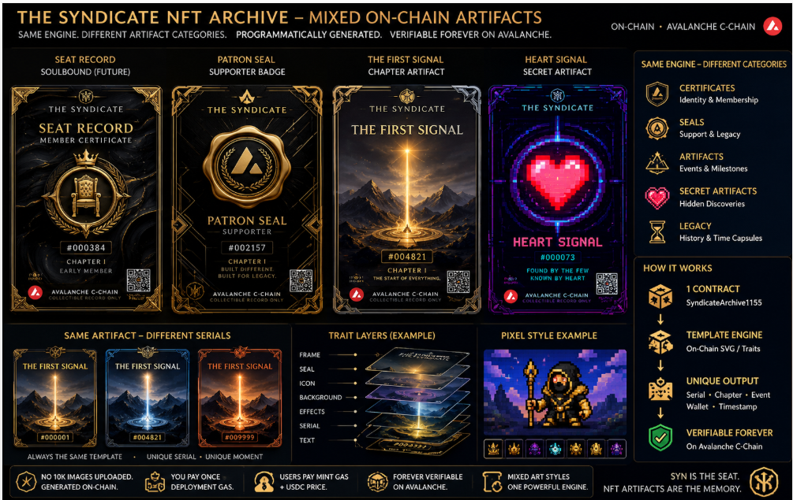
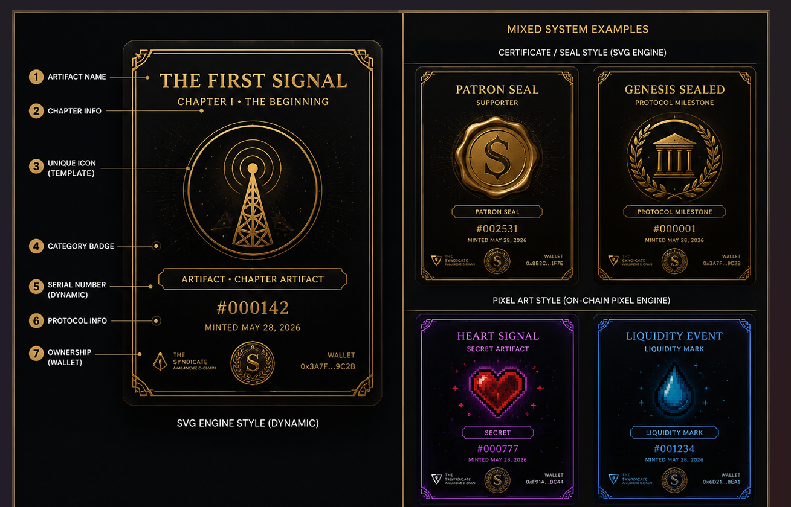
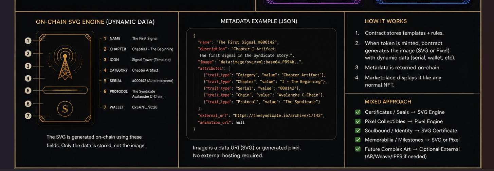
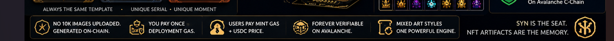

> **Historical note:** this document predates the current chapter/NFT doctrine. It is kept for record and must not be used as implementation authority. See `docs/DOCUMENTATION_AUTHORITY_MAP.md`.

# The Syndicate NFT Archive — Explained

**Status:** REFERENCE DOC · adapted to our real deployed state (2026-06-06)
**Doctrine:** SYN is the seat. NFT Artifacts are the memory.

This document is the long-form, image-backed explanation of how the
NFT Archive actually works in The Syndicate today. It is adapted from
the three reference posters in `docs/design/` and corrects every
ambiguity those posters leave open — most importantly: **who pays for
what.**

If a future contributor wants to understand the Archive in one read,
this is that document.

---

## 1. The one-liner

**One contract. Many artifact families. All images generated on-chain.**

We do not upload 10,000 image files. We deploy **one** ERC-1155
contract (`SyndicateArchive1155`) that stores **templates and rules**
on-chain. Every time someone mints an artifact, the contract assembles
a unique image from those templates plus the minter's data (serial,
wallet, chapter, timestamp) and returns it as on-chain metadata.

Marketplaces (Joepegs, Campfire, OpenSea-compatible viewers on
Avalanche, etc.) render it like any standard NFT — because it **is**
a standard NFT. The only thing that's unusual is that the image lives
inside the contract instead of on IPFS or a centralized server.

---

## 2. Visual reference — the ecosystem

Five artifact families share **one** engine:

| Family             | What it is                                     | Status today                                |
| ------------------ | ---------------------------------------------- | ------------------------------------------- |
| **Certificates**   | Identity & Membership (Seat Record)            | LATER — separate ERC-721 contract           |
| **Seals**          | Support & Legacy (Patron Seal = ID 3)          | **LIVE — open public mint on Avalanche**    |
| **Artifacts**      | Events & Milestones (The First Signal = ID 1)  | **LIVE — open public mint on Avalanche**    |
| **Secret Artifacts** | Hidden Discoveries (Heart Signal, etc.)      | SEALED — requires discovery-proof verifier  |
| **Legacy**         | History & Time Capsules                        | SEALED — unseals when a chapter or era closes|

Today **The First Signal (ID 1, 0.50 USDC)** and the **Patron Seal
(ID 3, 5.00 USDC)** are both open public mints on Avalanche. The other
families exist in the contract architecture and on the roadmap. The
posters show them next to each other because they share the engine —
not because every one is open for mint.

---

## 3. Visual reference — single-artifact anatomy

Every artifact, regardless of visual family, carries the same **seven
anatomical fields**. This is the anatomy contract:

| # | Field            | Source                                  | Example                       |
| - | ---------------- | --------------------------------------- | ----------------------------- |
| 1 | Artifact name    | Template (per token ID)                 | "The First Signal"            |
| 2 | Chapter info     | Template (per token ID)                 | "Chapter I · The Beginning"   |
| 3 | Unique icon      | Template (SVG layer for that family)    | Signal Tower                  |
| 4 | Category badge   | Template (per family)                   | "Chapter Artifact"            |
| 5 | Serial number    | Dynamic — auto-incremented on mint      | `#000142`                     |
| 6 | Protocol info    | Constant — "The Syndicate · Avalanche"  | always present                |
| 7 | Wallet           | Dynamic — `msg.sender` truncated        | `0x3A7F…9C2B`                 |

Two visual systems share these seven fields:

- **SVG engine style** — clean black + gold, used for Certificates,
  Seals, and Chapter Artifacts. The First Signal lives here.
- **Pixel art style** — neon palette, used for Secret Artifacts and
  Liquidity Marks. Same anatomy, different art family.

This is why The First Signal and a future Heart Signal can look
nothing alike yet still belong to the same contract — only the
template layers differ; the data shape is identical.

---

## 4. Visual reference — the on-chain SVG engine

How a mint becomes an image, end-to-end:

1. **Contract stores templates + rules.** SVG layers (frame, seal,
   icon, background, effects, serial slot, text slot) and per-token
   metadata (name, chapter, category) are written into contract
   storage at deploy time.
2. **Mint composes the image.** When a user calls `mint(id, qty)`,
   the contract assembles those layers and fills the dynamic slots
   with the new serial, the minter's wallet, the timestamp, and the
   chapter info — at `tokenURI()` time, not at write time.
3. **Metadata returned on-chain.** `tokenURI(id)` returns a
   `data:application/json;base64,…` URI whose `image` field is a
   `data:image/svg+xml;base64,…` URI. No IPFS, no centralized host.
4. **Marketplaces display it like any normal NFT.** Avalanche-native
   viewers decode the data URI and render the SVG inline.

This is exactly what `ArchiveOnchainImage.tsx` does on `/nft` right
now: it calls `uri(1)`, decodes the base64 JSON, pulls the `image`
field, and renders it. No fallback to a centralized image — if the
contract can't return the SVG, we show "Unable to load on-chain SVG"
rather than fabricate art.

---

## 5. Economics — **who pays for what**

The reference poster lists five economic facts in a single strip. They
are easy to misread, so this is the explicit version:

| Poster icon                          | What it actually means                                                                                                  | Who pays                       |
| ------------------------------------ | ----------------------------------------------------------------------------------------------------------------------- | ------------------------------ |
| **NO 10K IMAGES UPLOADED · GENERATED ON-CHAIN** | We never upload a 10,000-PNG folder. The contract draws every image from stored templates.                  | nobody — this is a design choice|
| **YOU PAY ONCE · DEPLOYMENT GAS**    | **Founder cost.** The Syndicate paid Avalanche gas **once** to deploy the contract with all templates baked in.        | **The founder. NOT the user.** |
| **USERS PAY MINT GAS + USDC PRICE**  | When a member mints, they pay (a) Avalanche gas for the `mint()` transaction (cents) and (b) the artifact's USDC price. | **The user — and only this.**  |
| **FOREVER VERIFIABLE ON AVALANCHE**  | Once minted, the image and metadata live in contract storage on Avalanche C-Chain. No host, no expiry, no broken link.  | nobody — it's already paid     |
| **MIXED ART STYLES · ONE ENGINE**    | SVG family (gold) and Pixel family (neon) coexist in the same contract because both are just template layers.            | nobody — it's an engine fact   |

### 5.1 Why this matters

The poster says **"YOU PAY ONCE — DEPLOYMENT GAS"** which, read in a
hurry, sounds like the user pays a one-time deployment fee. They do
not. **Deployment gas is a one-time cost the founder absorbed before
the public mint was opened.** Members never see it.

What a member actually pays to mint **The First Signal (ID 1)** today:

- **Mint gas:** Avalanche C-Chain transaction fee — typically a few
  cents in AVAX. Set by the network, not by us.
- **Artifact price:** `0.50 USDC` per mint (the current price for
  ID 1). Routed by the contract.
- **Approval gas (first-time only):** if the wallet has never
  approved USDC for the Archive contract, one extra small AVAX gas
  fee to `approve()` USDC. Subsequent mints skip this.

That's it. No subscription, no platform fee, no hidden charge, no
"holder rights" cost. The price is positional (you got serial #N at
block height H) — it is not an investment, not a yield product, and
not a claim on revenue.

### 5.2 The compact rule we put on the site

> **You pay:** ~a few cents of AVAX gas + the artifact's USDC price.
> **We paid (once, before launch):** deployment gas for the whole
> engine.
> **Forever after:** the image lives on Avalanche. No host bill, no
> expiring link.

---

## 6. Mapping the reference to our reality (status table)

This is the honest, non-marketing version of "what's live vs.
roadmap." It overrides anything implied by the posters.

| Reference element                              | Today's reality                                                                                  |
| ---------------------------------------------- | ------------------------------------------------------------------------------------------------ |
| Seat Record (soulbound)                        | **NOT live** — will ship later as a **separate ERC-721**, not as an ID inside Archive1155.       |
| Patron Seal                                    | **NOT live** — deferred. ID reserved, `maxSupply = 0` = LOCKED (never "unlimited").              |
| The First Signal (Chapter Artifact, ID 1)      | **LIVE** — public mint open on Avalanche, 0.50 USDC, wallet limit 5, on-chain SVG renderer.      |
| Heart Signal / Secret Artifacts                | **NOT live** — needs discovery-proof verifier.                                                   |
| Liquidity Event / Liquidity Mark               | **NOT live** — needs LP snapshot prover.                                                         |
| Genesis Sealed / Protocol Milestone            | **NOT live** — needs on-chain milestone event source.                                            |
| Pixel-art family                               | **NOT live** — engine supports it; no token in this family is open.                              |
| QR codes shown on cards                        | **Illustrative only** — the live SVG does not currently render a QR code.                        |
| Wallet addresses / serials / dates on posters  | **Placeholders.** Real values come from the contract at `tokenURI` time.                         |
| "1 CONTRACT · SyndicateArchive1155"            | **Accurate.** This is exactly what is deployed.                                                  |
| "Verifiable forever on Avalanche C-Chain"      | **Accurate** for everything that has actually been minted.                                       |

The constitutional rule from `SMART_CONTRACTS_DEFERRED.md` still
holds: every artifact family except ID 1 stays behind the seven gates
(legal review · constitutional review · spec freeze · external audit
· testnet deployment · indexer parity · production lock).

---

## 7. Where each piece lives in the code

| Concern                          | File                                                          |
| -------------------------------- | ------------------------------------------------------------- |
| Contract ABI (frontend copy)     | `src/lib/archive-nft-abi.ts`                                  |
| Contract address + chain         | `src/lib/syndicate-config.ts` (`ARCHIVE_NFT_CONTRACT_ADDRESS`)|
| Live read hooks                  | `src/lib/archive-nft-hooks.ts`                                |
| On-chain SVG renderer (UI)       | `src/components/syndicate/ArchiveOnchainImage.tsx`            |
| Mint state machine + CTA         | `src/components/syndicate/MintFirstSignal.tsx`                |
| Chapter I hero (public mint page)| `src/components/syndicate/ChapterOneHero.tsx`                 |
| Public route                     | `src/routes/nft.tsx` (also `/nfts` alias, `/archive` internal)|
| Truth states / labels            | `src/lib/archive-truth-states.ts`                             |
| Architecture decision (Seat)     | `docs/SEAT_RECORD_ARCHITECTURE_DECISION.md`                   |
| Visual system freeze             | `docs/NFT_ARCHIVE_VISUAL_SYSTEM_V1.md`                        |
| Metadata philosophy              | `docs/NFT_ARCHIVE_METADATA_PHILOSOPHY.md`                     |
| Deferred contract gates          | `docs/SMART_CONTRACTS_DEFERRED.md`                            |
| Reference-image intent           | `docs/NFT_ARCHIVE_DESIGN_REFERENCES.md`                       |

---

## 8. What this document is and is not

**It is:**

- The plain-English explanation of the Archive, adapted to what is
  actually deployed today.
- The single source of truth for "who pays for what."
- The companion to the three reference posters in `docs/design/`.

**It is not:**

- A promise that any deferred artifact family will ever ship.
- A price commitment beyond the currently live ID 1 mint
  (`0.50 USDC`).
- A claim that the Archive is an investment, yield product, dividend,
  revenue share, or governance instrument. It is none of those.

If anything in this document drifts from the contract or from
`VISION.md`, the contract and `VISION.md` win — fix this file.

---

*SYN is the seat. NFT Artifacts are the memory.*
