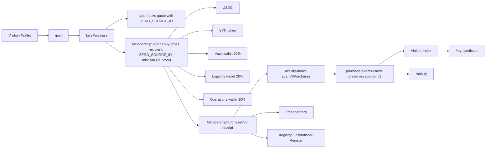
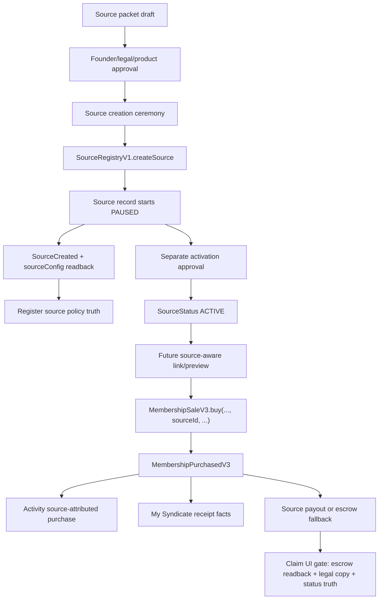
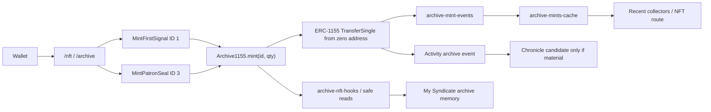
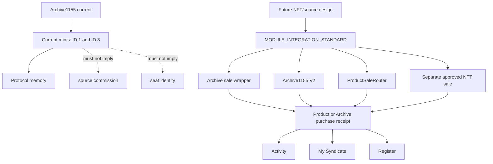
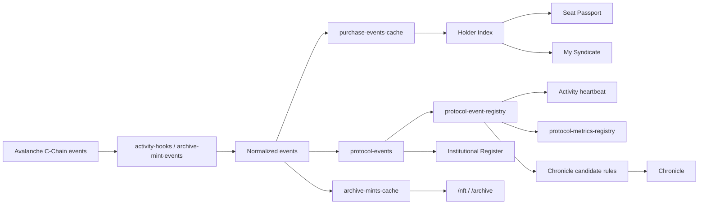
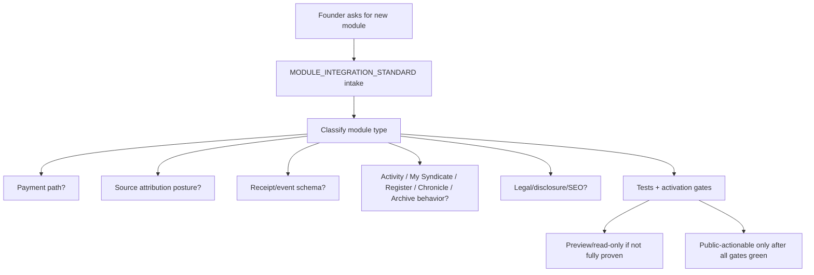

# Protocol Organism Graph

Status: CANONICAL MODULE RELATIONSHIP MAP / NO TRANSACTION AUTHORIZED

This document maps how The Syndicate's contracts, modules, receipts, read
models, routes, source attribution, treasury routing, memory layers, and future
modules connect.

It exists to prevent page-by-page patches from fragmenting the protocol. Future
work must use this graph together with `docs/MODULE_INTEGRATION_STANDARD.md`
before adding new payment paths, read models, public routes, source-aware
surfaces, Archive/NFT systems, SwapRail, product commerce, claim UI, or identity
modules.

This document does not authorize a mainnet transaction, source record,
source-aware public buy path, claim UI, contract deployment, contract change,
funding movement, V2b recovery, registry switch, production publish, SwapRail,
SeatRecord721, ERC-721 implementation, Archive1155 V2, Archive sale wrapper,
ProductSaleRouter, or any public activation.

## 1. Purpose

The Syndicate is a protocol organism, not a stack of isolated pages.

The same on-chain movement can affect:

- the member's seat,
- the V3 receipt,
- Holder Index identity,
- Activity,
- My Syndicate,
- Transparency,
- Institutional Register,
- Chronicle candidates,
- Archive memory,
- future source attribution,
- future recognition,
- future notifications.

This graph gives future work a wiring map before implementation. When adding or
changing a module, the question is not only "what route changes?" It is:

1. Which contract or provider is the source of truth?
2. Which payment path moves funds, if any?
3. Which receipt/event proves the action?
4. Which read models and caches consume it?
5. Which pages render it?
6. Which legal/disclosure boundaries apply?
7. Which ceremony or activation gate is required?
8. Which existing module must not be implied as live?

## 2. Graph Legend

### Node Types

| Type | Meaning |
| --- | --- |
| `contract` | Deployed or candidate smart contract. |
| `module` | Product or protocol capability spanning code, routes, docs, and reads. |
| `route/page` | Public or internal route that renders state or actions. |
| `receipt/event` | On-chain event or receipt schema that proves state movement. |
| `read-model/cache` | Parser, indexer, hook, local cache, registry, or derived model. |
| `doctrine/doc` | Canonical or operational document controlling meaning. |
| `treasury/accounting destination` | Wallet, LP, accounting category, or routed fund destination. |
| `source/attribution policy` | SourceRegistry policy state, source packet, or source ceremony artifact. |
| `activation ceremony` | Manual approval/readback path before public action. |
| `future/planned module` | Planned node that must remain inactive until its own gates pass. |

### Edge Types

| Edge | Meaning |
| --- | --- |
| `reads` | Node consumes on-chain, registry, or doc truth. |
| `writes` | Node performs a wallet/contract write when public-actionable. |
| `emits` | Contract emits an event or receipt. |
| `caches` | Read model persists or restores a normalized event. |
| `renders` | Route/page displays node state. |
| `routes funds` | Contract or provider moves assets. |
| `requires approval` | Manual founder/operator/legal/source packet approval required. |
| `activates` | Ceremony or status change makes a feature actionable. |
| `blocks` | Guard prevents action or fake-live copy. |
| `future candidate` | Possible future edge; not live today. |
| `must not imply` | Explicit non-edge. UI/docs must not claim this relationship. |

## 3. Current Live / Proven Graph

### Current Truth Table

| Node | Type | Current status | Main source of truth |
| --- | --- | --- | --- |
| SYN token | contract | LIVE | `src/lib/contract-registry.ts`, `docs/canon/02_SOURCE_OF_TRUTH_TABLE.md` |
| MembershipSaleV3 | contract/module | LIVE direct-buy target, funded, owner accepted | `contracts/src/MembershipSaleV3.sol`, `src/lib/sale-hooks.ts` |
| SourceRegistryV1 | contract/source policy | DEPLOYED, owner accepted, one internal PAUSED source record | `contracts/src/SourceRegistryV1.sol`, source readiness docs |
| Public/default V3 buy | module | LIVE with `ZERO_SOURCE_ID` only | `src/components/syndicate/LivePurchase.tsx`, `src/lib/sale-hooks.ts` |
| V3 receipt | receipt/event | LIVE for V3 buys | `MembershipPurchasedV3` |
| V2b sale | contract | PAUSED / historical scan source | `docs/canon/02_SOURCE_OF_TRUTH_TABLE.md` |
| Holder Index | read-model/cache | LIVE derived identity model | `src/lib/holder-index.ts`, purchase event scans |
| Activity | read-model/route | LIVE heartbeat | `src/lib/protocol-events.ts`, `src/lib/protocol-event-registry.ts` |
| My Syndicate | route/page | LIVE member home | `src/routes/my-syndicate.tsx` |
| Institutional Register | route/page/module | LIVE proof surface | `src/lib/institutional-register-registry.ts`, `/registry` |
| Chronicle | route/page/module | PARTIAL curated history | `src/lib/chronicle-entries.ts`, `/chronicle` |
| Archive1155 | contract/module | LIVE protocol memory, not source-aware | `docs/ARCHIVE1155_CANONICAL_ARCHITECTURE.md` |
| Archive mint events | receipt/event | LIVE for ERC-1155 mints | `TransferSingle` from zero address |
| `/join` | route/page | LIVE primary write path | `LivePurchase`, sale hooks |
| `/referral` | route/page | PENDING / noindex / read-only | `src/routes/referral.tsx` |
| `/nft` and `/archive` | route/page | LIVE memory surfaces | Archive components and hooks |
| Claim UI | future/planned module | INACTIVE | no public route/action |
| Source records | source/attribution policy | ZERO records | SourceRegistry readback docs |

### Current V3 Direct-Buy Graph



Current rule: public/default V3 buy uses `ZERO_SOURCE_ID`. Source attribution is
not active merely because SourceRegistryV1 exists.

### Receipt And Routing Meaning

For a direct public buy:

```text
grossUsdc = protocolContribution
acquisitionCost = 0
protocolContribution splits:
  70% Vault
  20% Liquidity
  10% Operations
```

The receipt is the operational source for Activity, My Syndicate, Transparency,
and future Register/Chronicle/Archive decisions.

## 4. Source Attribution Graph

### Source Layer Roles

| Node | Role | Current status |
| --- | --- | --- |
| SourceRegistryV1 | Source policy registry. Stores terms, status, payout wallet, metadata hash. | Deployed; zero records. |
| MembershipSaleV3 | Source-aware sale engine. Reads SourceRegistryV1 only when non-zero sourceId is supplied. | Live direct-buy target, public default uses zero source. |
| Source packet | Off-chain approval artifact before source creation. | Template exists; first internal packet remains draft. |
| Source creation ceremony | Manual on-chain `createSource` step. | Not performed. |
| Source activation ceremony | Separate `setSourceStatus(ACTIVE)` decision. | Not performed. |
| Claim UI | Future escrow read/claim surface. | Not live. |

### Source Attribution Lifecycle Graph



### Source Non-Edges Today

| Non-edge | Current rule |
| --- | --- |
| SourceRegistryV1 -> Archive1155 | No edge. Archive1155 does not accept `sourceId`. |
| SourceRegistryV1 -> SwapRail | No edge. SwapRail is not implemented and not source-aware. |
| SourceRegistryV1 -> ProductSaleRouter | No edge. ProductSaleRouter does not exist. |
| SourceRegistryV1 -> claim UI | No public edge. Escrow exists in MembershipSaleV3, but claim UI is inactive. |
| SourceRegistryV1 -> member ownership | Must not imply. A source never owns a member. |
| CommissionRouterV1 -> V3 source engine | No active edge. CommissionRouterV1 is not the active V3 source engine. |

### Source Activation Gates

Before any public source path:

1. Source packet approved.
2. Source record created on-chain with initial `PAUSED` status.
3. SourceCreated event and `sourceConfig` read back.
4. Legal/product copy approved.
5. Source-aware UI preview tested.
6. Public/default `ZERO_SOURCE_ID` path remains safe.
7. Activation transaction separately approved.
8. Activity/My Syndicate receipt rendering tested.
9. Claim UI remains hidden until escrow/status/legal gates pass.

## 5. Archive / NFT Graph

Archive is protocol memory, not the membership seat and not source attribution.

Current Archive graph:



Current Archive non-edges:

- No `sourceId` edge.
- No `acquisitionCost` edge.
- No V3 receipt edge.
- No ProductSaleRouter edge.
- No SeatRecord721 identity edge.
- No claim UI edge.

### Archive / NFT Current vs Future Graph



Future NFT/ERC-721 work must answer:

1. Is this identity or memory?
2. Is this a sale contract or token contract?
3. Does it read SourceRegistryV1 or a future source registry?
4. Does it emit receipt fields for acquisition cost and net routed amount?
5. Does it affect My Syndicate, Activity, Register, Chronicle, or Archive?
6. Does it require a mint/payment ceremony?
7. How does copy avoid implying financial rights?

## 6. Event / Read-Model Propagation Graph



Read-model rules:

- Events are parsed once and classified centrally.
- Cache must preserve source family, especially `source: "v3"`.
- Holder Index derives identity from purchase history, not from UI memory.
- Chronicle eligibility is advisory and curated, never automatic marketing copy.
- Register preserves durable truth, not private off-chain promises.
- Archive preserves memory objects or historically meaningful memory, not every
  routine event.

## 7. Future Module Graph

Future modules are planned nodes until their own design, receipt, tests,
disclosures, and activation ceremonies are complete.



### Future Module Relationship Table

| Future module | Current status | Can read now | Cannot do now | Required payment path | Required receipt/event | Existing layers affected | Activation gate |
| --- | --- | --- | --- | --- | --- | --- | --- |
| SwapRail / bridge / trade | Not implemented | Wallet, chain, provider quotes only after provider integration | Cannot seat wallet, cannot claim membership routing, cannot source-pay by default | External provider first; contract only if custody/routing/fees are internalized | `SwapRailReceipt` or external tx proof | Activity, My Syndicate utility history, Transparency if fees exist | Provider review, fee/slippage disclosure, QA, no hidden routing |
| SeatRecord721 / identity | Future | Holder Index, SYN balance, receipts | Cannot replace SYN as seat, cannot mint public identity today | None unless future policy adds fee | Identity lifecycle event schema | My Syndicate, Register, Chronicle, future recovery | Identity spec, recovery policy, audit, deployment/readback |
| Archive sale wrapper / Archive V2 | Future | Archive1155 IDs, SourceRegistry policy if designed | Cannot source-attribute current Archive1155 mints | Wrapper/router or new Archive sale contract | Archive/product purchase receipt | Archive, NFT route, Activity, My Syndicate, Register | Module standard, contract design, legal copy, tests, readback |
| ProductSaleRouter | Future | SourceRegistry policy, product docs | Cannot sell anything today | New router/contract | `ProductPurchased` with productType/productId | Activity, My Syndicate, Register, Transparency | At least two mature product lines, audit, source terms |
| Premium/pass sale | Future | Member status, product docs | Cannot imply access or source commission today | Product-specific sale or ProductSaleRouter | Product receipt | My Syndicate access/pass panel, Activity | Product terms, legal copy, receipt schema |
| Marketplace/product sale | Future | Artifact ownership, product catalog if built | Cannot route seller/source funds today | Marketplace/router | Marketplace/ProductPurchased receipt | Archive, My Syndicate ownership/order history, Register | Seller policy, dispute/fulfillment model, audit |
| B2B/whitelabel source layer | Future/pending | SourceRegistry classes, source packet docs | Cannot imply official representation or product-wide attribution today | MembershipSaleV3 for SYN buys only until product layer exists | Source policy events and product receipts | Referral route, Register, Activity, My Syndicate | Source packet, legal/product signoff, PAUSED readback |
| Analytics/dashboard | Future/internal | Events, receipts, metrics registries | Cannot become source of truth | None | Derived analytics only | Dashboards, Member OS, operator reports | Privacy/data-source review, labels, tests |
| Claim UI/source dashboard | Future | `sourceEscrowOwed`, source status only after source record exists | Cannot display claims now | MembershipSaleV3 claim path only after approval | Claim events and escrow reads | Referral, My Syndicate, Activity, Register | Escrow readback, source status, legal copy, UX failure states |

## 8. Operational Questions This Graph Must Answer

### When adding a new module

Answer before implementation:

1. Which module type is it?
2. Which payment path does it use?
3. Is the payment path contract-owned, provider-owned, or off-chain/company-level?
4. Is it source-aware, read-model-only, future-wrapper-needed, or no attribution?
5. Which receipt/event proves it?
6. Which read-model consumers need updates?
7. Which route/page renders it?
8. Which disclosure and prohibited claims apply?
9. Which activation ceremony is required?
10. What is the rollback/pause path?
11. Which tests guard fake-live drift?

### When changing a contract

Check:

1. Which receipt fields change?
2. Which event scanners or ABIs change?
3. Which caches must preserve new fields?
4. Which routes render those fields?
5. Which docs and source-of-truth tables must update?
6. Which fork rehearsal/readback is needed?
7. Which legacy/historical contracts remain scan sources?

### When changing copy

Check:

1. Which doctrine does the copy touch?
2. Does it imply a pending module is live?
3. Does it imply a source owns a member?
4. Does it imply Archive/NFT source commission today?
5. Does it imply SeatRecord721 replaces SYN?
6. Does it imply SwapRail is membership, revenue routing, or source-aware?
7. Does it preserve `ZERO_SOURCE_ID` public/default buy truth?

### When adding NFT/ERC-721 work

Check:

1. Identity or memory?
2. ERC-721 or ERC-1155?
3. Sale contract or token contract?
4. Source-aware or not?
5. Receipt/event schema?
6. Read-model impact on Activity, My Syndicate, Register, Chronicle, Archive?
7. Legal copy and financial-rights disclaimers?
8. Activation ceremony and rollback?

### When adding SwapRail

Check:

1. Utility, revenue module, or product sale?
2. External provider or Syndicate contract?
3. Is there a Syndicate receipt or only external tx proof?
4. Are fees/slippage/provider risks disclosed before signature?
5. Does it affect seat status? Default answer: no.
6. Is source attribution allowed? Default answer: no.
7. Which Activity/My Syndicate category owns the event?

## 9. Must-Not-Imply Rules

| Surface | Must not imply |
| --- | --- |
| `/referral` | Source records live, public source links live, claim UI live, product-wide attribution live. |
| `/join` | Non-zero source IDs are public/default, or source terms are active. |
| `/nft` / `/archive` | Archive1155 is source-aware, NFTs are seats, or artifacts carry financial rights. |
| `/my-syndicate` | Pending systems are active, source attribution is identity, or Privy/SeatRecord replaces SYN. |
| Activity | Every event is Chronicle-worthy, or read-model data creates rights. |
| Register | Off-chain/private promises are durable protocol truth. |
| Chronicle | Routine accounting is history by default. |
| SwapRail future | Swapping equals joining, or external provider route equals protocol-routed membership receipt. |
| ProductSaleRouter future | Existing SourceRegistryV1 makes every product source-aware automatically. |

## 10. Authority And Use

This graph is CANONICAL as a module relationship map. It is subordinate to:

1. on-chain truth,
2. canonical registries,
3. execution gates,
4. constitutional doctrine,
5. `docs/MODULE_INTEGRATION_STANDARD.md`.

It should be used before implementation whenever future work touches:

- payment paths,
- source attribution,
- Archive/NFT systems,
- SeatRecord721,
- SwapRail,
- product commerce,
- Activity/My Syndicate/Register/Chronicle/Archive,
- routing/accounting,
- public claims,
- activation ceremonies.

If this graph conflicts with live on-chain reads or contract code, the code/read
is correct and this document must be updated.
