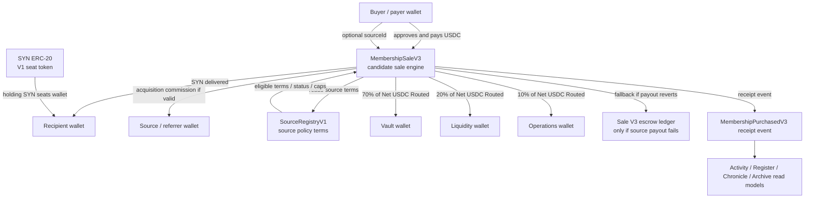
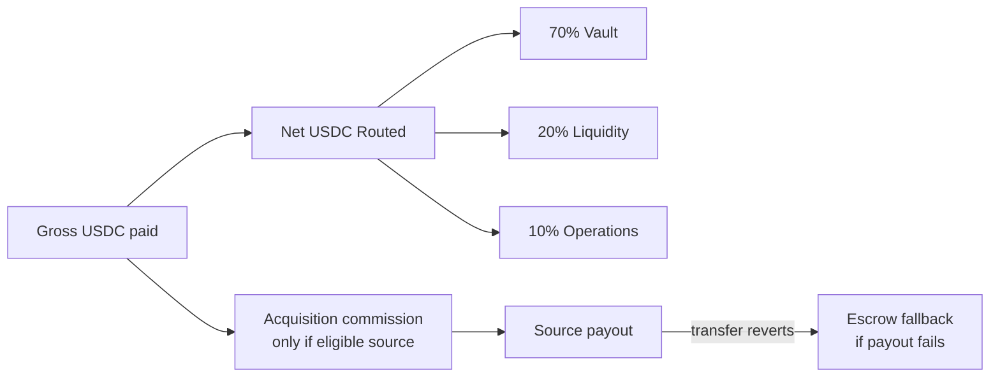
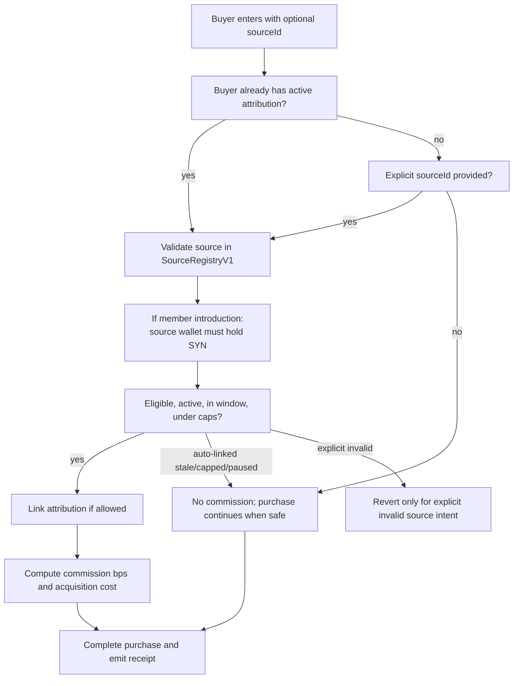

# V3 External Review Handoff Package

Status: EXTERNAL REVIEW READY / NO DEPLOYMENT AUTHORIZED / V3 NOT LIVE

This is the reviewer front door for The Syndicate V3 candidate. It is designed
for a reviewer who knows nothing about the project and needs to understand,
attack, and disposition V3 efficiently.

This package does not deploy, activate, register, frontend-wire, or publish V3.
V2b remains the live buy path until a separate deployment, verification,
funding, readback, registry update, and product activation pass is explicitly
approved.

## 1. Executive Summary

The Syndicate is a verifiable on-chain membership institution.

V3 introduces a candidate sale engine that keeps SYN as the V1 seat while
adding:

- deterministic era pricing,
- acquisition-first routing,
- source attribution,
- source payout with escrow fallback,
- richer receipt events,
- explicit source-policy records,
- clearer future read-model support for Activity, Register, Chronicle, Archive,
  My Syndicate, and notifications.

Primary candidate contracts:

- `contracts/src/SourceRegistryV1.sol`
- `contracts/src/MembershipSaleV3.sol`

Primary candidate tests:

- `contracts/test/SourceRegistryV1.t.sol`
- `contracts/test/MembershipSaleV3.t.sol`
- `contracts/test/RehearsalForkV3.t.sol`

Current internal verification status:

- QuickNode-backed Avalanche fork rehearsal: PASS
- SourceRegistryV1 targeted tests: PASS
- MembershipSaleV3 targeted tests: PASS
- frontend/release gate: PASS
- Slither: ran, findings require reviewer disposition
- Solhint second analyzer: ran, warnings only, no errors

Current deployment status:

- V3 is not deployed.
- V3 is not activated.
- No V3 address is in the live frontend registry.
- No referral or claim UI is live.
- No V3 buy path is live.

## 2. Protocol Purpose

The Syndicate product is not a token sale, NFT drop, dashboard, governance
portal, or yield product.

It is a membership institution where:

- holding SYN seats a wallet,
- the seat is binary,
- contribution is variable,
- USDC routing is transparent,
- Activity turns events into visibility,
- Register preserves institutional truth,
- Chronicle turns meaningful change into story,
- Archive1155 preserves protocol memory,
- future systems remain pending until deployed and verified.

V3 is intended to improve the membership entry engine while preserving that
doctrine.

## 3. Current Live Contracts

The live product remains on the current canonical contracts. V3 does not replace
them until a future activation pass.

| Contract / system | Status | Purpose |
| --- | --- | --- |
| SYN ERC-20 | LIVE | V1 membership seat token. Holding SYN seats the wallet. |
| Membership Sale V2b | LIVE BUY PATH | Current live membership purchase route. |
| Archive1155 | LIVE | Protocol memory artifacts. NFTs are memories, not seats. |
| CommissionRouterV1 | CANDIDATE / NOT LIVE | Older Operations-slice commission router, not the V3 acquisition engine. |
| SeatRecord721 | FUTURE / RESERVED | Future identity record. Not deployed. Does not replace SYN as the seat. |

Reviewer note: V3 must not mutate live contract truth during review.

## 4. Candidate Contracts

### SourceRegistryV1

Purpose:

- stores source policy terms,
- stores source class, status, scope, caps, window, commission bps, payout
  wallet, and metadata hash,
- emits visible source-policy events,
- does not move money,
- does not mint SYN,
- does not count seats,
- does not activate referral UI.

Owner powers:

- create source,
- update terms,
- update source wallet,
- update payout wallet,
- pause/revoke/reactivate source.

### MembershipSaleV3

Purpose:

- sells SYN using deterministic era pricing,
- validates source attribution through SourceRegistryV1,
- routes acquisition-first USDC,
- transfers SYN to the recipient,
- emits reconstructable receipt events,
- supports escrow fallback when source payout fails,
- preserves first-seat/member-number behavior,
- remains a candidate until deployed, funded, verified, and activated.

## 5. Architecture Diagram



## 6. Money Flow Diagram



Formula:

```text
grossUsdc - acquisitionCost = netUsdcRouted
netUsdcRouted * 70% = vaultAmount
netUsdcRouted * 20% = liquidityAmount
netUsdcRouted - vaultAmount - liquidityAmount = operationsAmount
```

Conservation invariant:

```text
acquisitionCost + vaultAmount + liquidityAmount + operationsAmount == grossUsdc
```

## 7. Acquisition Flow Diagram



Reviewer focus:

- explicit invalid source behavior,
- stale auto-linked source behavior,
- cap boundary behavior,
- attribution hijack protection,
- referrer losing seat after attribution,
- source pause/revoke after attribution.

## 8. Identity Model

Binding identity doctrine:

- SYN is the V1 seat.
- A wallet is seated when it holds SYN.
- The seat is binary.
- Contribution is variable.
- A buyer and recipient can differ.
- Repeat contribution does not create a second seat.
- SeatRecord721 is future identity-record infrastructure only; it is not part
  of V3 and does not replace SYN.

V3 contract identity behavior:

- first purchase for a new recipient assigns a member number,
- repeat purchase preserves the existing member identity,
- receipt emits `firstSeat`,
- V1 historical recognition can be included through proof root behavior,
- no source or referrer owns a member relationship.

## 9. Attribution Model

Attribution is proof of introduction/source contribution. It is not ownership of
a member, not a downline, not yield, not passive income, and not governance.

Core V3 attribution rules:

- source terms live in SourceRegistryV1,
- source must be active and eligible,
- source class determines validation context,
- public member introduction requires the source wallet to remain seated,
- self-referral is blocked,
- active attribution cannot be silently overwritten,
- repeat purchases can use linked attribution only inside configured terms,
- paused/revoked/capped/stale auto-linked sources do not block safe purchases,
- explicit invalid source intent can revert,
- source payout wallet can be updated through visible policy action,
- history is not rewritten when source state changes.

## 10. Admin Powers

Current owner model: hardware-wallet-first, founder-led, before protocol
maturity. Safe/multisig/timelock are future control-evolution stages.

### SourceRegistryV1 powers

| Power | Exists? | Visibility | Reviewer focus |
| --- | --- | --- | --- |
| Create source | Yes | Event-backed | Can owner create unsafe terms? Are caps enforced? |
| Update source terms | Yes | Event-backed | Can terms exceed caps or silently change source wallet? |
| Pause source | Yes | Event-backed | Does pause stop future commission safely? |
| Revoke source | Yes | Event-backed | Does revoke stop new attribution without rewriting history? |
| Update source wallet | Yes | Event-backed | Is compromise/recovery flow bounded? |
| Update payout wallet | Yes | Event-backed | Does escrow claim use current payout wallet safely? |

### MembershipSaleV3 powers

| Power | Exists? | Visibility | Reviewer focus |
| --- | --- | --- | --- |
| Pause / unpause sale | Yes | Contract state | Emergency control acceptable? |
| Recover unsold SYN | Yes, constrained | Contract state / tx | Can owner drain live sale inventory early? |
| Rescue tokens | Yes, excludes USDC/SYN | Contract state / tx | Can owner steal buyer funds or seat inventory? |

Reviewer should confirm owner powers match the hardware-wallet deployment
package and do not contradict public product truth.

## 11. Security Assumptions

Assumptions that must hold:

- Avalanche USDC behaves as a standard ERC-20 for transfer/transferFrom.
- SYN behaves as expected for seat-token transfer.
- V3 is funded with approved SYN inventory before activation.
- Owner wallet is a dedicated hardware wallet.
- Source policy actions are publicly recorded and operationally logged.
- Frontend does not point to V3 before deployment/readback/activation.
- Legal/product copy does not frame acquisition as yield, passive income,
  employment, agency, MLM, or guaranteed returns.

Non-assumptions:

- V3 does not assume a source owns a buyer.
- V3 does not assume source wallets are always safe.
- V3 does not assume payout wallets cannot fail.
- V3 does not assume the frontend is the source of truth.

## 12. Test Coverage Summary

Targeted V3 tests currently pass:

```text
SourceRegistryV1Test: 18 passed
MembershipSaleV3Test: 22 passed
RehearsalForkV3Test: 4 passed
```

Release gate currently passes:

```text
npm run check-release
92 frontend test files passed
1,794 frontend tests passed
production build passed
release gate passed
```

Key tested areas:

- source creation/update/status lifecycle,
- source caps and per-buyer caps,
- commission cap enforcement,
- source payout wallet updates,
- source wallet recovery visibility,
- no-source purchase routing,
- acquisition-first source purchase routing,
- gross/net/routing conservation,
- fuzzed conservation and rounding,
- smart-contract payout wallet compatibility,
- blocked payout escrow fallback,
- escrow claim using current registry payout wallet,
- repeat purchase inside and after attribution window,
- paused/revoked linked source behavior,
- explicit invalid source behavior,
- referrer losing seat,
- attribution hijack protection,
- self-referral block,
- unseated public referrer rejection,
- receipt event reconstruction,
- buyer/recipient distinction,
- member number and first-seat behavior.

Full unfiltered Foundry suite note:

- the full suite timed out locally in the Windows shell twice, ending with a
  Windows pipe-close error rather than a Solidity assertion failure,
- the V3-critical suites above passed,
- a clean full-suite run in CI/Linux/WSL/reviewer environment is still
  recommended before deployment.

## 13. Fork Rehearsal Summary

Real QuickNode-backed Avalanche fork rehearsal was run with:

```text
cd contracts
AVAX_RPC=<QuickNode HTTPS endpoint> forge test --match-contract RehearsalForkV3 --evm-version cancun -vv
```

No private keys. No broadcast. No deployment.

Result:

```text
4 passed
0 failed
0 skipped
```

Passed fork checks:

- Avalanche fork started through QuickNode,
- live USDC/SYN/protocol wallet constants matched rehearsal assumptions,
- SourceRegistryV1 deploy/readback worked on fork,
- MembershipSaleV3 deploy/readback worked on fork,
- no-source buy worked,
- source-attributed buy worked,
- acquisition-first routing worked,
- normal source payout worked,
- blocked source payout escrowed without blocking buy,
- smart-wallet payout compatibility shape passed,
- receipt reconstruction passed,
- member number / first-seat behavior passed,
- V2b / Archive posture stayed historical/live as expected,
- no registry activation was performed.

Known fork noise:

- Foundry printed an RPC cache-file warning. This is not a contract failure.

## 14. Known Findings

### Slither

Slither ran successfully after adding Foundry to PATH for that process.

Findings requiring reviewer disposition:

- benign reentrancy-sensitive shape around `MembershipSaleV3` payout/escrow
  fallback,
- strict equality checks around seated-source validation and zero amount sends,
- timestamp comparisons for attribution windows, caps, and recovery timelocks,
- uninitialized locals that default to false/zero in intended paths,
- unused tuple return values in preview reads,
- complexity/style/naming/pragma findings.

Current internal disposition:

- no critical exploit confirmed by tests,
- payout/escrow reentrancy remains the most important reviewer item,
- strict equality around `SYN.balanceOf(sourceWallet) == 0` appears intentional
  because public member introductions require a seated source wallet,
- timestamp/window checks are policy logic, but still require review.

### Solhint

Solhint ran as the second analyzer using a temporary recommended-rule config.

Result:

```text
0 errors
210 warnings
```

Warning categories:

- NatSpec/documentation coverage,
- gas/style suggestions,
- function length / empty block / strict-inequality style warnings,
- import-path-check false positives because the temporary Solhint config does
  not understand Foundry remappings.

No direct exploit-class issue was reported by Solhint.

### Aderyn

Aderyn was not run because Rust/Cargo is not available in the current Windows
environment. Solhint is the current second-analyzer substitute.

## 15. Known Blockers

### Critical

None confirmed by internal tests or fork rehearsal.

### High

| Blocker | Why it matters | Required action | Blocks |
| --- | --- | --- | --- |
| External human review not complete | V3 moves USDC, controls source terms, and manages escrow. | Send this package to reviewer and resolve findings. | Deployment |
| Owner hardware-wallet addresses not frozen | Owner powers are material before maturity. | Freeze deployment wallet and owner wallet addresses; rehearse Ownable2Step readback. | Deployment |
| Legal/product signoff not complete | Acquisition copy must avoid yield/passive income/agency/MLM drift. | Legal/product review of source/referral language and receipts. | Activation |
| Clean full Foundry run in stable environment still recommended | Local Windows shell timed out on full unfiltered run. | Run full suite in CI/Linux/WSL/reviewer environment. | Deployment confidence |

### Medium

| Blocker | Why it matters | Required action | Blocks |
| --- | --- | --- | --- |
| Slither payout/escrow warning needs disposition | Direct payout is the most sensitive money path. | Reviewer signs off or recommends patch. | Deployment |
| NatSpec/reviewer readability gaps | External review is easier with richer contract comments. | Optional documentation pass if reviewer requests it. | Review quality, not current tests |
| Aderyn unavailable | Solhint ran as substitute, but Aderyn remains useful. | Optional run in Rust-ready environment. | Extra assurance |

### Low

| Item | Why it matters | Required action | Blocks |
| --- | --- | --- | --- |
| Vite third-party `"use client"` warnings | Build logs are noisy. | No action unless dependencies change. | Nothing current |
| Foundry RPC cache warning | Fork run logs include cache noise. | No action. | Nothing current |

## 16. Reviewer Questions

Reviewer should explicitly answer:

1. Can `MembershipSaleV3` direct payout and escrow fallback be deployed as-is?
2. Can a source payout wallet grief a normal purchase?
3. Can escrow be stolen, orphaned, double-claimed, or made unrecoverable?
4. Can acquisition cost ever exceed source terms or V3 caps?
5. Can active attribution be hijacked by a later source?
6. Can an existing seated member be captured by a new source?
7. Does referrer losing SYN stop future public-member commission correctly?
8. Are paused and revoked source behaviors safe for both explicit and
   auto-linked purchase paths?
9. Are receipt events sufficient to reconstruct every USDC/SYN movement?
10. Does `firstSeat` / `memberNumber` preserve the binary seat doctrine?
11. Can owner powers drain USDC, steal SYN, mutate pricing, or hide source
    policy changes contrary to docs?
12. Are pause/recovery powers acceptable for the current hardware-wallet-first
    founder-led stage?
13. Is deterministic era pricing implemented consistently with docs/tests?
14. Do source terms create legal/UX risk that should be mitigated before
    activation?
15. Is V3 safe for deployment preparation after review fixes, without live
    activation?

## 17. Go / No-Go Boundaries

### External review

GO.

V3 is ready to send to external review as a candidate package.

### Deployment preparation

CONDITIONAL GO.

Allowed:

- freeze hardware-wallet addresses,
- prepare constructor parameter sheet,
- rerun static analysis,
- rerun fork rehearsal,
- prepare source verification materials.

Not allowed:

- broadcast deployment,
- fund sale,
- update frontend registry,
- mark V3 live,
- activate referral/source UI,
- add claim UI.

### Deployment

NO-GO until:

- external review complete,
- Slither payout/escrow warning dispositioned,
- owner/deployment hardware wallet addresses frozen,
- full suite run in stable environment or reviewer accepts targeted evidence,
- legal/product signoff complete,
- deployment parameter sheet frozen,
- founder explicitly approves deployment transaction.

### Activation

NO-GO until:

- V3 deployed,
- source verified,
- ownership read back,
- sale inventory funded,
- constructor state read back,
- frontend registry updated through a reviewed commit,
- release gate green,
- product activation copy reviewed,
- founder explicitly approves live cutover.

## 18. Reviewer File Map

Review these first:

- `contracts/src/SourceRegistryV1.sol`
- `contracts/src/MembershipSaleV3.sol`
- `contracts/test/SourceRegistryV1.t.sol`
- `contracts/test/MembershipSaleV3.t.sol`
- `contracts/test/RehearsalForkV3.t.sol`
- `docs/V3_PROTOCOL_ENGINE_CONSTITUTION.md`
- `docs/IDENTITY_ATTRIBUTION_CONSTITUTION.md`
- `docs/V3_ACQUISITION_ENGINE_TEST_PLAN.md`
- `docs/V3_SMART_CONTRACT_QA_READINESS.md`
- `docs/V3_DEPLOYMENT_READINESS_PACKAGE.md`
- `docs/DOCUMENTATION_AUTHORITY_MAP.md`
- `docs/SMART_CONTRACT_SYSTEM_MAP.md`

Supporting context:

- `contracts/src/SyndicateSaleV2.sol`
- `contracts/src/CommissionRouterV1.sol`
- `contracts/test/SyndicateSaleV2.t.sol`
- `contracts/test/CommissionRouterV1.t.sol`
- `src/lib/contract-registry.ts`
- `src/routes/v3-preview.tsx`

## 19. Exact Reviewer Workflow

1. Read this file.
2. Read the two candidate contracts.
3. Read the three V3 test files.
4. Run targeted V3 tests:

```text
cd contracts
forge test --match-contract SourceRegistryV1Test -vv
forge test --match-contract MembershipSaleV3Test -vv
AVAX_RPC=<QuickNode HTTPS endpoint> forge test --match-contract RehearsalForkV3 --evm-version cancun -vv
```

5. Run full Foundry suite in reviewer environment:

```text
cd contracts
forge test
```

6. Run Slither:

```text
cd contracts
slither . --exclude-dependencies
```

7. Run a second analyzer of reviewer choice.
8. Disposition every finding.
9. Answer the reviewer questions.
10. Return one of:
    - safe for deployment preparation,
    - safe only after fixes,
    - reject deployment until redesign.

No step in this workflow authorizes deployment or live activation.
